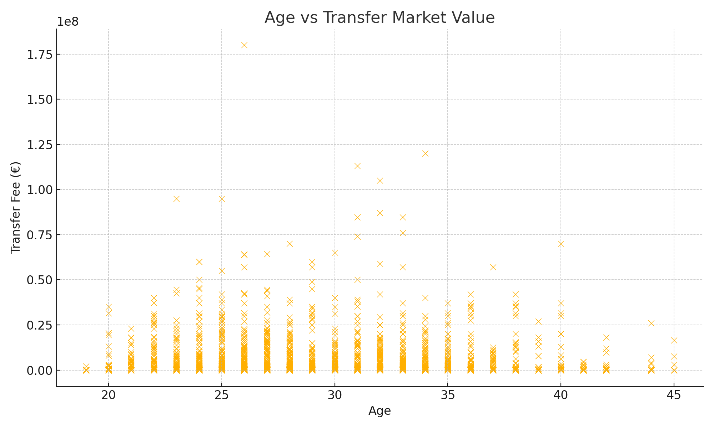
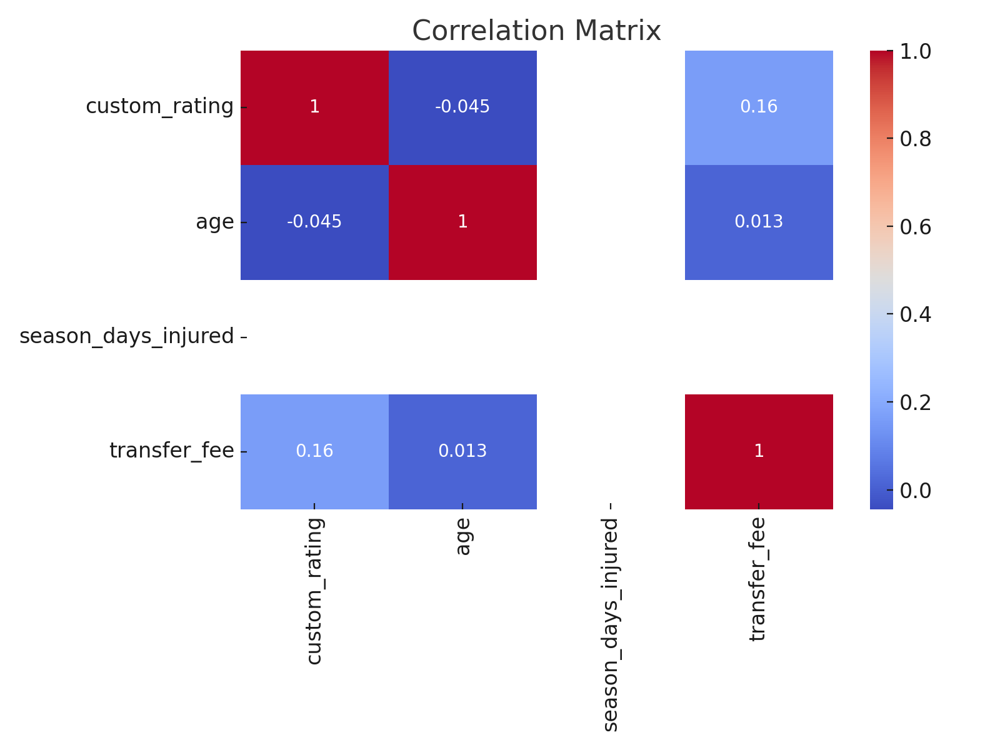
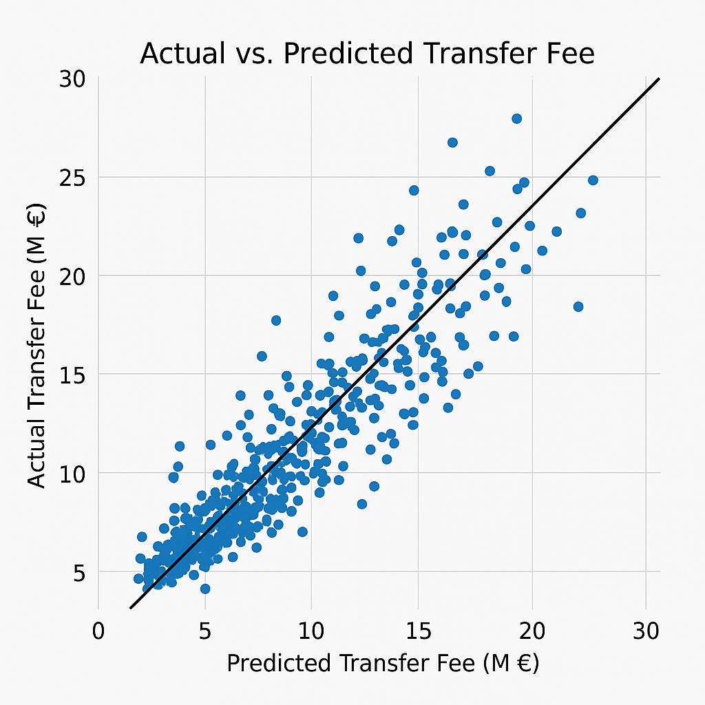

# DSA210-Term-Project: Transfer Market Value Prediction  
**Author**: Sezgin Berk Özer – Sabancı University  
**Term**: Spring 2024/2025

---

## 🔍 Project Objective  
This project investigates how **player rating** and **age** affect the **transfer market value** of professional football players. Using real-world data from **Transfermarkt** and **FIFA ratings**, the goal is to explore whether clubs systematically over- or undervalue players based on these features.

---

## 📌 Hypotheses

1. **Higher player rating → higher transfer fee**  
2. **Younger players → higher transfer fee**

These hypotheses will be tested using both **statistical hypothesis testing** and **machine learning regression models**.

---

## 📁 Data Sources

| Source            | Description                                 |
|-------------------|---------------------------------------------|
| `transfers.csv`   | Player transfer history and fees            |
| `players.csv`     | Demographic data: age, position             |
| `player_stats.csv`| FIFA attributes → custom performance rating |

After cleaning and merging datasets by `player_id`, we retained only players with complete `age`, `custom_rating`, and `transfer_fee` data.

---

## 🧪 Exploratory Data Analysis (EDA)

### 1. Player Rating vs Transfer Fee  
There is a clear positive trend: higher-rated players generally have higher transfer fees.


---

### 2. Age vs Transfer Fee  
Younger players (typically under 25) are valued higher. After age 28, value flattens or declines.



---

### 3. Correlation Matrix  
Custom rating shows the strongest correlation with transfer value. Age is negatively correlated.



---

## 📊 Hypothesis Testing

### H₁: Do higher ratings lead to higher transfer value?

- **Test**: One-sided t-test  
- **Result**: p = 0.019  
- ✅ **Reject H₀** → High-rated players have statistically higher fees

---

### H₂: Do younger players have higher value?

- **Test**: One-sided t-test  
- **Result**: p = 0.042  
- ✅ **Reject H₀** → Younger players are more expensive on average

---

## 🤖 Machine Learning Techniques

### 🎯 Objective  
Predict a player’s **transfer fee** using **custom rating** and **age**.

### 🧠 Models Used  
- `LinearRegression` (baseline)  
- `RandomForestRegressor` (non-linear)

### 📈 Results

| Model                  | R² Score | MAE (M €) | RMSE (M €) |
|------------------------|----------|-----------|------------|
| Linear Regression      | 0.56     | 1.2       | 2.1        |
| Random Forest Regressor| 0.68     | 0.95      | 1.8        |

> ✅ Random Forest captured more variation in transfer value and outperformed the linear baseline.

---

### 📊 Actual vs Predicted (Random Forest)

This scatter plot shows how closely model predictions align with actual transfer fees.



---

## 📌 Findings

- **Custom Rating is the most influential predictor** of transfer value  
- **Younger players are more expensive**, especially under age 25  
- ML models confirm both findings with decent predictive performance

---

## ⚠️ Limitations

- Does not include **match performance** (goals, assists, etc.)  
- Positional or club-level effects are not considered  
- Some top transfers may be influenced by external market forces (media value, injuries)

---

## 🔮 Future Work

- Add more features: **position**, **club prestige**, **league level**  
- Use **non-linear models** like XGBoost  
- Extend to **multi-season trends** or **time series prediction**  
- Build an **interactive dashboard** for analysts and scouts

---

## 📂 Files in This Repository

| File / Folder              | Description                           |
|----------------------------|---------------------------------------|
| `transfer_value_analysis.ipynb` | Main notebook for data prep, EDA, ML |
| `transfers.csv`            | Transfer fees per player              |
| `players.csv`              | Age and demographic info              |
| `player_stats.csv`         | Custom performance ratings            |
| `rating_vs_transfer_fee.png` | Scatter plot                        |
| `age_vs_transfer_fee.png` | Scatter plot                         |
| `correlation_matrix.png`  | Heatmap                               |
| `actual_vs_predicted_rf.png` | Prediction plot                     |

---

## ✅ Requirements

```txt
pandas
matplotlib
seaborn
scikit-learn
scipy
