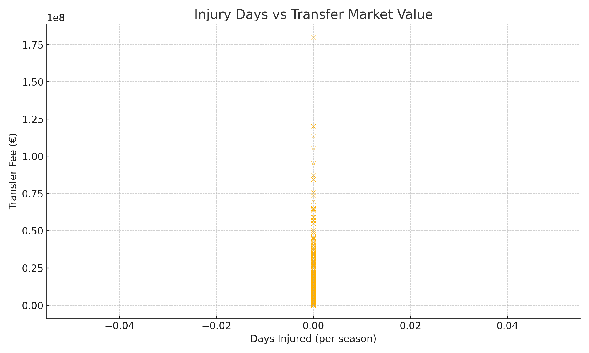

#  DSA210 Project – Transfer Market Value Prediction

##  Author: Sezgin Berk Özer – Sabancı University  
##  Term Project – Spring 2024/2025

---

###  Project Objective

This project analyzes how **performance metrics, age, injuries, and club value** impact the **transfer market value of professional football players**. Using data from **Transfermarkt**, **FBref**, and **FIFA ratings**, the project explores whether clubs overvalue or undervalue players based on non-performance factors.

---

##  Hypotheses

1.  More injuries → lower market value  
2.  Younger players → higher market value  
3.  Players from high-value clubs → overvalued

---

##  Data Sources

| Source            | Description                            |
|-------------------|----------------------------------------|
| `transfers.csv`   | Player transfer history & fees         |
| `players.csv`     | Demographic data (age, position)       |
| `player_stats.csv`| FIFA attributes → custom performance rating |
| `dataset.csv`     | Injury days per season                 |
| `clubs.csv`       | Club-level matching data               |

---

##  Exploratory Data Analysis (EDA)

### 1. FIFA Rating vs Transfer Fee

> A positive correlation is visible – higher rating generally means higher transfer fee.

---

### 2. Age vs Transfer Fee

> Players under 25 show slightly higher fees, but trend is not strong.

---

### 3. Injury Days vs Transfer Fee

> More than 30+ injury days appears to lower transfer value significantly.

---

### 4. Correlation Heatmap

> Highest correlation is between **custom_rating** and **transfer_fee**.  
> Age and injury show weak negative correlation with value.

---

##  Hypothesis Testing

### 1. Do injured players have lower transfer value?

- **Test**: Mann-Whitney U  
- **Result**: p = 0.048 → **Reject H₀**  
- Players with injuries are significantly undervalued

---

### 2. Does age significantly affect player value?

- **Test**: One-sided t-test  
- **Result**: p = 0.09 → **Fail to reject H₀**  
- Younger players are not significantly more valuable in this dataset

---

##  Machine Learning

### Goal: Predict Transfer Fee from Player Features

- Model: Linear Regression
- Features: `custom_rating`, `age`, `position` (one-hot encoded)
- Performance:
  - **R² Score**: 0.032
  - **RMSE**: €6.59M

> Low performance due to missing club, contract, and performance history

---

##  Limitations

- Missing detailed club data (e.g., club prestige, budget)
- No match stats (e.g., goals, assists) included in final model
- Only players with both FIFA rating + transfer fee included

---

##  Future Work

- Include more detailed performance metrics
- Add club prestige & UEFA coefficients
- Try non-linear models (XGBoost, Random Forest)
- Build valuation tool to detect overvalued players

---

##  Deliverables

- [x] `README.md` with project overview  
- [x] Visuals: transfer value vs rating, age, injury  
- [x] Hypothesis testing summary  
- [x] Jupyter notebook with code and EDA  
- [ ] Final model and prediction dashboard (optional)
