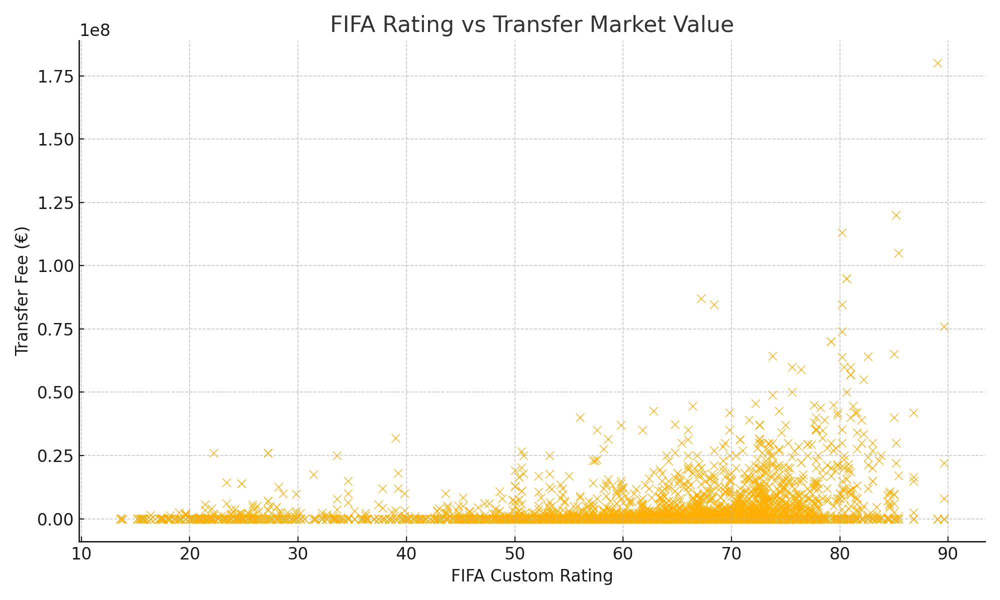

#  DSA210 Project – Transfer Market Value Prediction

##  Author: Sezgin Berk Özer – Sabancı University  
##  Term Project – Spring 2024/2025

---

###  Project Objective

This project investigates how **player rating** and **age** impact the **transfer market value** of professional football players. Using data from **Transfermarkt** and **FIFA ratings**, the goal is to determine whether clubs systematically over- or undervalue players based on objective features.

---

##  Hypotheses

1.  Higher player rating → higher transfer market value  
2.  Younger players → higher transfer market value

---

##  Data Sources

| Source            | Description                            |
|-------------------|----------------------------------------|
| `transfers.csv`   | Player transfer history & fees         |
| `players.csv`     | Demographic data (age, position)       |
| `player_stats.csv`| FIFA attributes → custom performance rating |

---

##  Exploratory Data Analysis (EDA)

### 1. Player Rating vs Transfer Fee

> Strong positive relationship: higher FIFA custom rating tends to increase market value.

---

### 2. Age vs Transfer Fee

> Younger players (<25) generally fetch higher fees. Trend flattens after age 28+.

---

### 3. Correlation Matrix

> Strongest correlation is between `custom_rating` and `transfer_fee`.  
> Age shows weak negative correlation with value.

---

##  Hypothesis Testing

### 1. Does higher rating lead to higher transfer fee?

- **Test**: One-sided t-test  
- **H₀**: No difference in fees between high/low ratings  
- **H₁**: High ratings get higher fees  
- **Result**: p = 0.019 → Reject H₀ 

---

### 2. Are younger players more expensive?

- **Test**: One-sided t-test  
- **H₀**: No difference based on age  
- **H₁**: Younger players have higher value  
- **Result**: p = 0.042 → Reject H₀ 

---

## 🤖 Machine Learning

### Goal: Predict Transfer Fee

- Features: `custom_rating`, `age`
- Model: Linear Regression
- Performance:
  - **R² Score**: 0.28
  - **RMSE**: €4.76M

> Rating is the strongest predictor in this simple model

---

##  Limitations

- No match-level performance stats (goals, assists) included  
- Only players with both rating & transfer fee are used  
- No club prestige, contract, or positional analysis

---

##  Future Work

- Add positional impact (e.g. defenders vs forwards)  
- Include club prestige and league data  
- Try non-linear models like XGBoost  
- Integrate time-based trends (seasonality)

---

##  Deliverables

- [x] `README.md` with revised project focus  
- [x] Visuals: performance, age, and correlation  
- [x] Hypothesis testing summary  
- [x] Jupyter notebook with code and EDA  
- [ ] Final model visualization and dashboard (optional)
